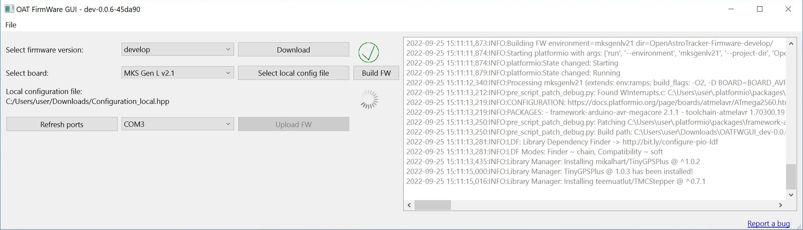
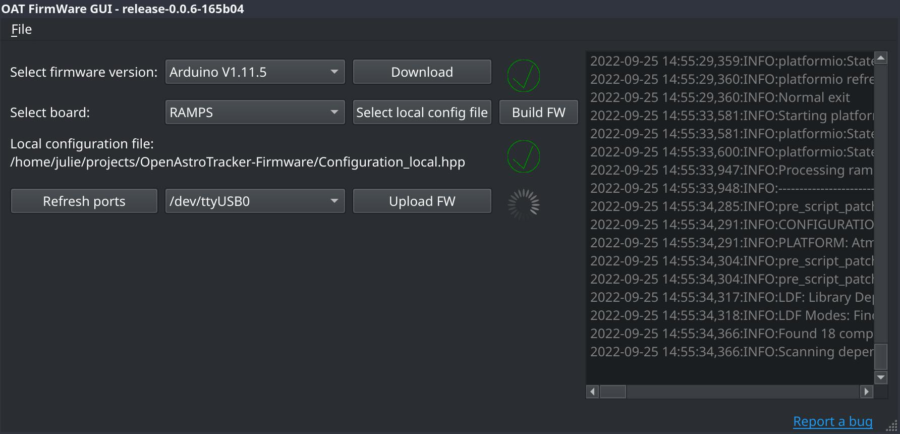

# OAT FirmWare GUI


OpenAstroTech FirmWare Graphical User Interface -- A graphical way to build and load firmware onto an OpenAstroTracker/OpenAstroMount.

## Supported platforms
- Windows 64 bit
- Linux 64 bit
  - Requires Python 3.9..3.13, git, libc >= 2.28 (check with `ldd --version`)

MacOS support [is in progress](https://github.com/OpenAstroTech/OATFWGUI/commits/feature/js/official-mac-support/), but isn't reliable yet.

## Installing
Simply download the [latest release](https://github.com/OpenAstroTech/OATFWGUI/releases), unzip and run:
- Windows: `OATFWGUI_Windows.bat`
  - Visual C++ Redistributable is needed, otherwise an error regarding "vcruntime140.dll is missing pops up.
- Linux: `OATFWGUI_Linux.sh`
  - Override the python interpreter by setting `PYTHON` (i.e. `PYTHON=/usr/bin/python3.10 ./OATFWGUI_Linux.sh`)
  - This creates a local python virtual environment in `.venv_OATFWGUI`. If there's an error during the first run, delete that folder to have the script try again.

> :warning: **OATFWGUI requires an active internet connection!**

## Uninstalling
OATFWGUI only has two directories:
1. Find the plaformio core directory and delete it
    * Open up a log file from the `logs` folder
    * Near the top will be a log line like `DEBUG:Setting PLATFORMIO_CORE_DIR to C:\Users\RUNNER~1\AppData\Local\Temp\.pio_OATFWGUI_dev-0.0.9-c3592b`
    * This step is not necessary on Linux, the folder is automatically removed when the computer is restarted
2. Delete the extracted folder (something like `OATFWGUI_1.0.0-release+f5e4f6_Windows_X64`)

## Screenshots
Windows:


Linux:


## Development
To run the app:
```shell
$ python3 -m venv .venv # Create a virtual environment in .venv
$ ./.venv/bin/pip install -r requirements.txt # Install requirements
$ source .venv/bin/activate && ./OATFWGUI/main.py # Run the app
```

To run the widget designer you need python development libraries:
- Fedora: `sudo dnf install python3-devel`
- Ubuntu (probably, not tested): `sudo apt install python3-dev`

- then:
`source .venv/bin/activate && env PYSIDE_DESIGNER_PLUGINS=$(realpath ./OATFWGUI) pyside6-designer`

Open `main_widget.ui` in the designer
