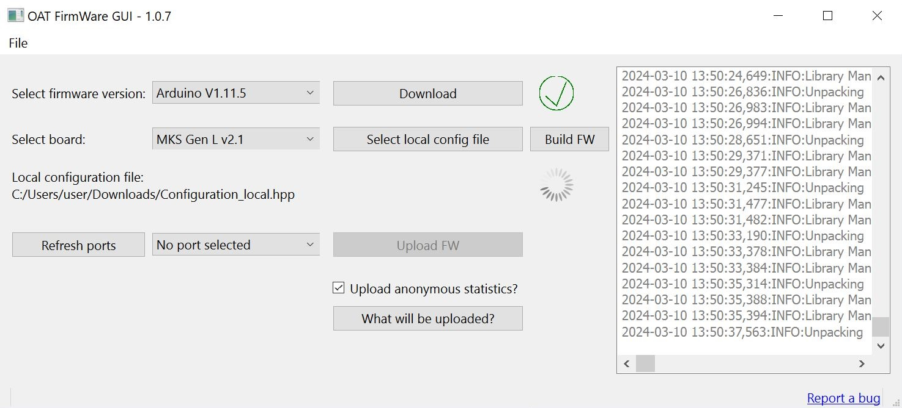
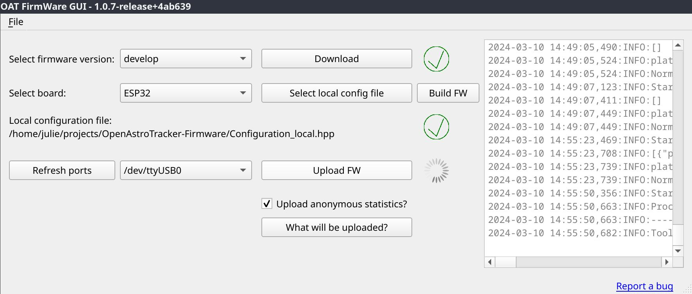

# OAT FirmWare GUI
OpenAstroTech FirmWare Graphical User Interface -- Graphical way to build and load firmware onto an OpenAstroTracker/OpenAstroMount.

## Supported platforms
- Windows 64 bit
- Linux 64 bit
  - Requires Python 3.7+, libc >= 2.28 (check with `ldd --version`)

MacOS might work, don't have a mac to test on. Drop a line if you're willing to test it!

## Installing
Simply download the [latest release](https://github.com/OpenAstroTech/OATFWGUI/releases), unzip and run:
- Windows: `OATFWGUI.exe`
- Linux: `OATFWGUI_Linux.sh`
  - Override the python interpreter by setting `PYTHON` (i.e. `PYTHON=/usr/bin/python3.10 ./OATFWGUI_Linux.sh`)
  - This creates a local python virtual environment in `.venv_OATFWGUI`. If there's an error during the first run, delete that folder to have the script try again.

> :warning: **OATFWGUI requires an active internet connection!**

It is a local installation, so to remove it simply delete the folder.
(it also creates a platformio core directory in your system's temporary folder, but those should be deleted after a system restart.
The exact folder depends on your system, but is noted at startup. Something like `DEBUG:Setting PLATFORMIO_CORE_DIR to C:\Users\RUNNER~1\AppData\Local\Temp\.pio_OATFWGUI_dev-0.0.9-c3592b`)

## Screenshots
Windows:

Linux:

